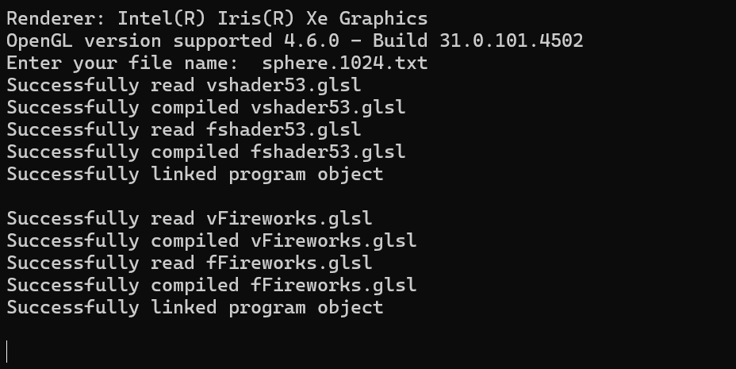
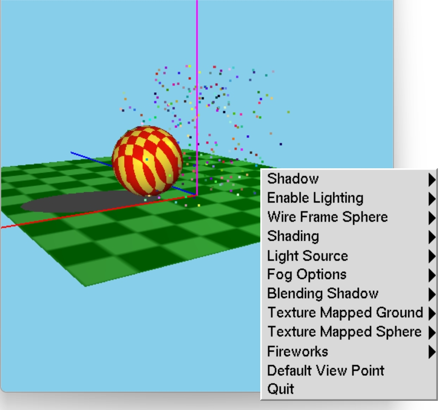
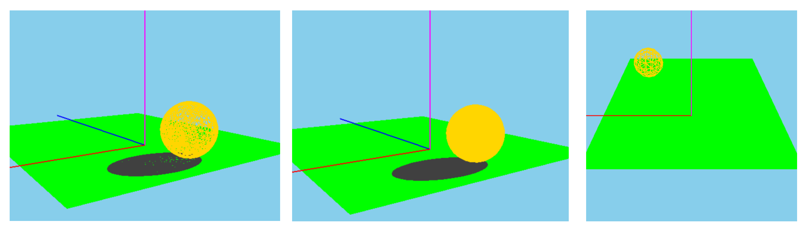
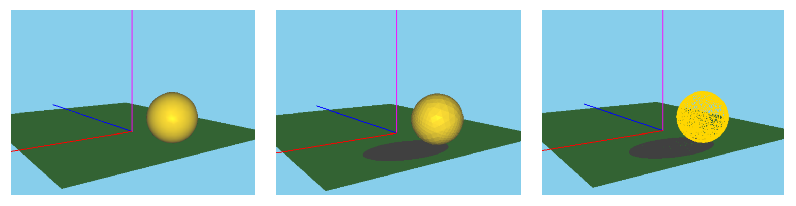
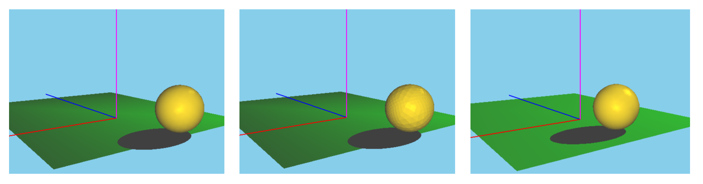
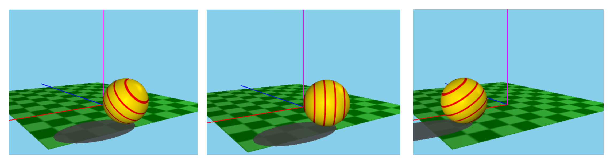
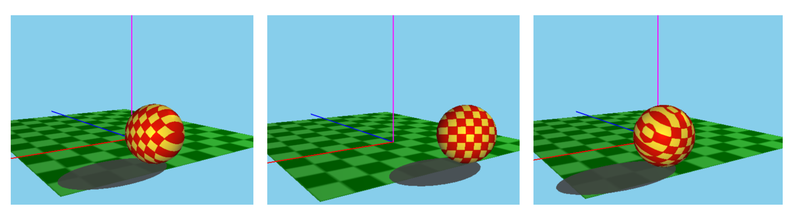
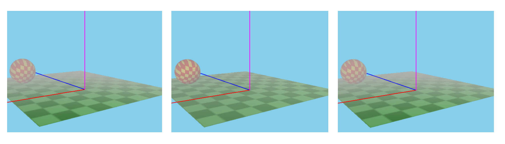
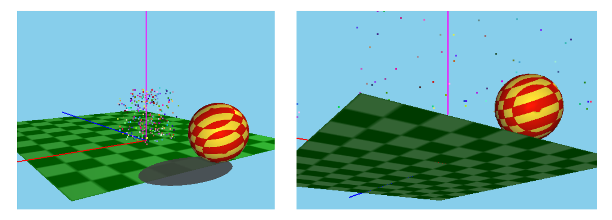

This repo contains code for producing a rolling sphere animation, combined with various visual effects such as lighting, shading, texture mapping, fog and firework based on opengl and glsl.

The main logic are in `main.cpp`.The vertex shaders and fragment shaders for the sphere (including fog effect) and the firework are in `vshader53.glsl`, `fshader53.glsl`, `vFireworks.glsl` and `fFireworks.glsl`, respectively. The rest of  files are some basic functions and definitions to be used (e.g., `vec3, vec4`), which usually can be directly copied without making any changes.

- Setup visual studio and opengl
- Build and compile the project
- When the compile is done, enter the filename of the sphere vertex in `/sphere_vertex_files` in  the terminal. When the complie complete, a graphic window will show and the terminal will display something like this
	
- In the graphic window, a sphere, a floor and a axis will be show. By pressing `B/b` the sphere will start to roll in the ground and by right-clicking the mouse, the rolling will stop.
- By left-clicking the mouse, the following menu will show and you can control the visual effect of the whole scene by selecting the menu items
	
- And you can change the view of the scene by pressing `Y/y` and `X/x` and return to the default viewport by selecting the `Default View Port` in the menu.
- Visual effect display
	- Sphere without any lighting 
		- There are wireframe and filled mode for the sphere). 
		- And you can choose to enable the shadow or not.
			
	- Directional lighting with different shading (smooth shading, flat shading and wireframe, repectively)
		
	- Positinal lighting with different shading (spotlight+smooth shading, spotlight+flat shading, and point sorce+smooth shading, respectively)
		
	- 1D Texture mapping (contour lines) with checkerboard mapping floor
		- For slanted contour lines, press `S/s` (left)
		- For vertical contour lines, press `V/v` (middle)
		- Viewing in eye epace, press `E/e` (left). Viewing in object epace, press `O/o` (right)
		
	- 2D Texture mapping (checkerboard) with checkerboard mapping floor
		-  For slanted checkerboard, press `S/s` (left)
		- For vertical checkerboard, press `V/v` (middle)
		- Viewing in eye epace, press `E/e` (left). Viewing in object epace, press `O/o` (right)
		
	- Fog effect (linear fog, expenential Fog, expenential square fog, respectively)
		
	- Firework effect
		